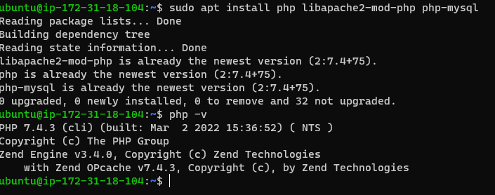
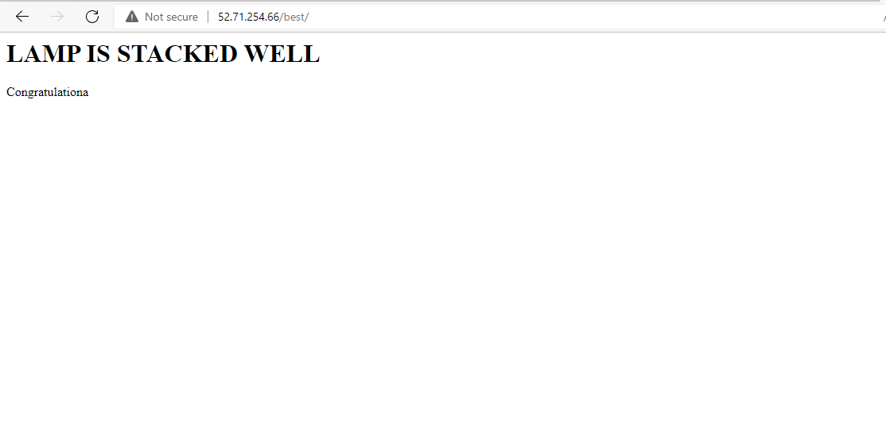

## H2 project1 documentation

`sudo apt update`

`sudo apt install apache2`

`sudo systemctl status apache2`

- [Install SSHServer](https://docs.microsoft.com/en-us/windows-server/administration/openssh/openssh_keymanagement)

## H2 SQL documentation

`sudo apt install mysql-server`

`sudo mysql_secure_installation`

`sudo mysql`

## H2 PHP documentation

`sudo apt install php libapache2-mod-php php-mysql`

`php -v`

## H2 VIRTUAL HOST DOCUMENTATION

`sudo mv /var/www/html/index.html /var/www/html/index.html.bak`

`sudo nano /var/www/html/index.html`

`sudo mkdir -p /var/www/html/best`

` sudo chown -R $USER:$USER /var/www/html/best`

`sudo chmod 755 -R /var/www/html/best`

` sudo cp /var/www/html/index.html /var/www/html/best`

`sudo nano /etc/apache2/sites-available/best.conf`

`sudo a2ensite best.conf`

`sudo systemctl reload apache2`

